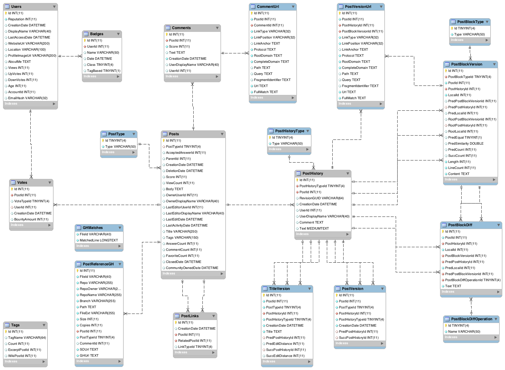

# About The SO and SOTorrent

Stack Overflow (SO) is the most popular question-and-answer (Q&A) website for software developers, providing a large amount of copyable code snippets. SOTorrent, an open dataset based on the official SO data dump. SOTorrent provides access to the version history of SO content at the level of whole posts and individual text and code blocks. 
[Reference](https://arxiv.org/pdf/1809.02814.pdf)

## Related Papers

1. [SOTorrent: Studying the Origin, Evolution, and Usage of Stack Overflow Code Snippets](https://arxiv.org/abs/1809.02814)
2. [SOTorrent: Reconstructing and Analyzing the Evolution of Stack Overflow Posts](https://arxiv.org/abs/1803.07311)

## Dataset

The Stack Overflow data has been extracted from the official [Stack Exchange data dump](https://archive.org/details/stackexchange) released 2021-09-07. 

The GitHub references have been retrieved from the [Google BigQuery GitHub data set](https://cloud.google.com/bigquery/public-data/github) on 2021-01-04 (last updated 2020-12-31 according to table info).


## Stack Exchange Vs. Stack Overflow

Stack Exchange is a network of sites, of which Stack Overflow is one. [This website](https://stackexchange.com/sites) indicates the coverage of the Stack Exchange website. In addition, Stack Overflow is a question and answer site for professional and enthusiast programmers. It's built and run by you as part of the Stack Exchange network of Q&A sites. 
[Reference](https://meta.stackexchange.com/questions/79593/what-is-the-difference-between-stack-overflow-and-stack-exchange)


## Offline Working - For OSX and Linux OSs

### 1. Import the Stack Exchange data dump to PC

As I mentioned before, on the [Stack Exchange data dump](https://archive.org/details/stackexchange) page we can find all data dumps that Stack Exchange covers inside itself. However, we currently need just datasets related to the Stack Overflow website.
 
 0. Change the current directory to the working directory.
 ```console
 aminghadesi@MOOSELab$ cd <working_directory_path>
 aminghadesi@MOOSELab$ wget https://github.com/ghadesi/db-scripts/archive/refs/heads/master.zip
 aminghadesi@MOOSELab$ unzip master.zip
 aminghadesi@MOOSELab$ mkdir sotorrent && cd ./sotorrent
 ```
 1. Run the [`1_download_so-dump.sh`](so-dump/1_download_so-dump.sh) script. This script download files related to Stack Overflow.
 ```console
 aminghadesi@MOOSELab$ chmod +x ../db-scripts-master/sotorrent/so-dump/1_download_so-dump.sh
 aminghadesi@MOOSELab$ sh ../db-scripts-master/sotorrent/so-dump/1_download_so-dump.sh
 ```
If you are using SSH, it's better to run the task at background.
 ```console
 aminghadesi@MOOSELab$ nohup sh ../db-scripts-master/sotorrent/so-dump/1_download_so-dump.sh &
```
By the bellow command we can check the status of download.
 ```console
 aminghadesi@MOOSELab$ watch tail -2 nohup.out
```
 2. Run the [`2_process_7z_files.sh`](so-dump/2_process_7z_files.sh)  script. This script unzips all CSV and XML files.
 ```console
 aminghadesi@MOOSELab$ source ../db-scripts-master/sotorrent/so-dump/2_process_7z_files.sh
 ```

### 2. Install MySQL 
In this step, we have to create a SQL database for inserting dataset into our local database. 

> Set password for `root` and `sotorrent` MySQL users

* For OSX 11.5.2:
	- [This doc](https://flaviocopes.com/mysql-how-to-install/) helps us to create and start this service on our OSX.
* For Ubuntu Distribution 20.04:
	- [This doc](https://www.digitalocean.com/community/tutorials/how-to-install-mysql-on-ubuntu-18-04) aids to establish and prepare MySQL service on Ubuntu OS.

### 3. Prepare and Load SOTorrent Dataset

Edit the SQL script [`load_sotorrent.sh`](load_sotorrent.sh) to change:
- The passwords for the `root` and `sotorrent` MySQL users
- The path where the MySQL dump files are located.

For loading the SOTorrent dataset to created database, we should run [`load_sotorrent.sh`](load_sotorrent.sh) script.
```console
 aminghadesi@MOOSELab$ source load_sotorrent.sh
```

<!-- ABOUT THE SCHEME -->
## Database schema of SOTorrent
Then below photo indicates the tables and their relations from the offical SO dump that are marked gray.



# Project
## Phase 0: Create Tags based on Stackoverflow (SO)

### We defined the major ML frameworks based on the Python language, including:

- TensorFlow: (https://www.tensorflow.org/) TensorFlow was developed at Google Brain and an open-source project. TF can: Perform regression, classification, neural networks, etc., and run on both CPUs and GPUs.

- PyTorch: (https://pytorch.org/) PyTorch was developed by FAIR, Facebook AI Research.  It is the leading competitor to TensorFlow. In addition, it provides almost the same TensorFlow services.

- Sikit-learn: (https://scikit-learn.org/stable/#) Scikit-learn provides a range of supervised and unsupervised learning algorithms via a consistent interface in Python.

- Keras: (https://keras.io/) Keras is a neural network library and a deep learning API written in Python, running on top of the machine learning platform TensorFlow. It was developed with a focus on enabling fast experimentation.

- NLTK: (https://www.nltk.org/) The Natural Language Toolkit, more commonly NLTK, is a suite of libraries and programs for symbolic and statistical natural language processing for English written in the Python programming language.

- Huggingface: (https://huggingface.co/) Hugging Face is an open-source provider of natural language processing (NLP) technologies.

- Spark ML: (https://spark.apache.org/docs/1.2.2/ml-guide.html) aims to provide a uniform set of high-level APIs that help users create and tune practical machine learning pipelines.

- Torch: (http://torch.ch/) We ignore this framework due to the Lua programming language.

### Find ML tags on the section of Stackoverflow (https://stackoverflow.com/tags):

This [website](https://data.stackexchange.com/stackoverflow/queries) aids us in extracting tags from SO DB; also, we can use pattern matching for our queries. The LIKE keyword searches specific patterns based on the regular expression to contain the pattern. Besides that, this [link](https://docs.microsoft.com/en-us/previous-versions/sql/sql-server-2008-r2/ms187489(v=sql.105)?redirectedfrom=MSDN) helps us to work with LIKE statement properly. In the end, we can find many quarry examples on this [page](https://data.stackexchange.com/stackoverflow/queries).

[Example](https://data.stackexchange.com/stackoverflow/query/1468684/identify-the-tensorflow-tags): 
```sql
-- Identify the Tensorflow tags related to ML
Select
CASE
  WHEN TagName LIKE '%tensorflow%' THEN 'tensorflow'
  WHEN TagName LIKE '%pytorch%' THEN 'pytorch'
  WHEN TagName LIKE '%scikit-learn%' THEN 'scikit-learn'
  WHEN TagName LIKE '%keras%' THEN 'keras'
  WHEN TagName LIKE '%nltk%' THEN 'nltk'
  WHEN TagName LIKE '%huggingface%' THEN 'huggingface'
  WHEN TagName LIKE '%spark-ml%' THEN 'spark-ml'
END As Framework, TagName, [Count]
From Tags
Where (TagName LIKE '%tensorflow%' OR
       TagName LIKE '%pytorch%' OR
       TagName LIKE '%scikit-learn%' OR
       TagName LIKE '%keras%' OR
       TagName LIKE '%nltk%' OR
       TagName LIKE '%huggingface%' OR
       TagName LIKE '%spark-ml%') AND
      [Count] > 0 -- We can ignore small tags numbers
ORDER BY [Count] DESC
```
----

1. Unzip all CSV and XML files.

   Windows (e.g. using [Cygwin](https://www.cygwin.com/) or [7zip](https://www.7-zip.org/)):

   `7za e *.7z`

   Linux (e.g. using [p7zip](https://sourceforge.net/projects/p7zip/)):

   `for file in ./*.7z; do 7z e "$file"; done`

2. Unzip the SQL scripts:

	`7za e sql.7z -osql`
  
3. Edit the SQL script `load_sotorrent.sh` to change the passwords for the `root` and `sotorrent` MySQL users and the path where the MySQL dump files are located.

4. Run the `load_sotorrent.sh` script.

----


## MySQL Troubleshooting

### Ubuntu and Windows: Configuration used to test the dataset

We used the following configuration to test the dataset. See also the remarks below this section.

Client configuration:

    [mysql]
    ...
    default-character-set=utf8mb4
    ...

Server configuration:

    [mysqld]
    ...
    collation-server=utf8mb4_unicode_ci
    secure-file-priv="/data/tmp" # update path as needed
    tmp_table_size=1G
    myisam_max_sort_file_size=100G
    myisam_sort_buffer_size=1G
    key_buffer_size=256M
    read_buffer_size=128K
    read_rnd_buffer_size=256K
    innodb_flush_log_at_trx_commit=1
    innodb_log_buffer_size=1M
    innodb_buffer_pool_size=48G # assumes system has 64GB RAM
    innodb_log_file_size=48M
    join_buffer_size=256M
    open_files_limit=4161
    sort_buffer_size=256M
    table_definition_cache=1400
    ...

### Ubuntu: AppArmor prevents access to files

In case an `OS errno 13 - Permission denied` error prevents you from importing the files, you may need to update your AppArmor configuration:

    sudo vim /etc/apparmor.d/usr.sbin.mysqld
    
    ...
    # Allow data dir access
      /var/lib/mysql/ r,
      /var/lib/mysql/** rwk,
      /data/tmp/** rwk, # add this line (update path as needed)
    ...
    
    sudo /etc/init.d/apparmor reload

### Windows: Camel-case table names

Add this to your server configuration:

    [mysqld]
    ...
    lower_case_table_names=2
    ...
